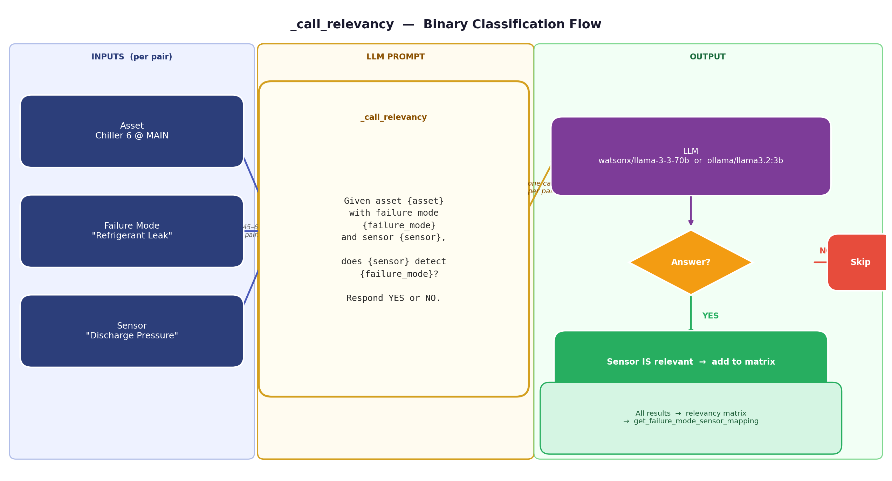
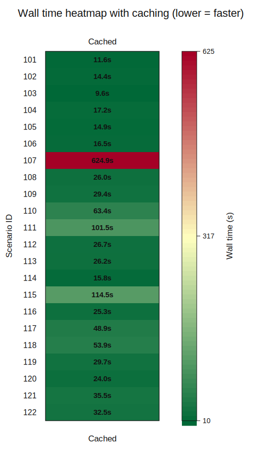
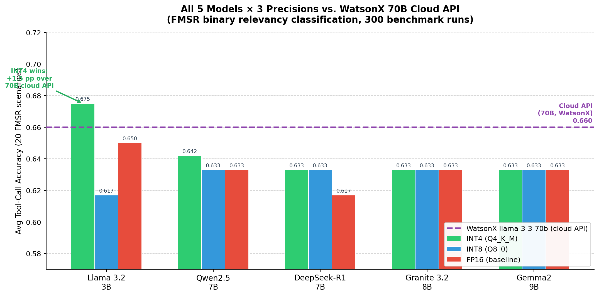
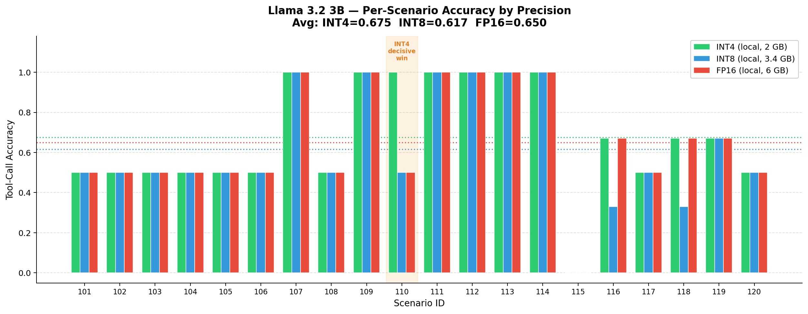

<div align="center">

# AssetOpsBench — HPML Performance Optimization Study

**Columbia University · HPML Spring 2026 · Course Project**

Yassine Jebbouri &nbsp;·&nbsp; Darief Rida Maes &nbsp;·&nbsp; Shriya Aishani Rachakonda &nbsp;·&nbsp; Vivek G. Iyer  
Advisor: Dr. Dhaval C. Patel &nbsp;·&nbsp; Instructor: Dr. Kaoutar El Maghraoui

[](https://wandb.ai/yj2922-columbia-university/AssetOpsBench)
[](https://github.com/yassinejebbouri/AssetOpsBench)

</div>

> **TL;DR** — We optimized a plan-execute MCP agent for industrial asset diagnostics. The dominant bottleneck is the FMSR server's N×M LLM call matrix (up to 63 sequential calls, 559–894 s wall time). Hedged parallelization cuts worst-case time by **36×** (559 s → 15.5 s). INT4-quantized Llama 3.2 3B matches the default WatsonX 70B cloud baseline at **2.0 GB** memory (−97%).

---

## Optimization Summary

| Strategy | Best Speedup | Status |
|---|---|---|
| **Hedged parallelization** | **36×** (559 s → 15.5 s) | ✅ Recommended for tail-bound scenarios |
| **Adaptive ceiling-start** | **20×** | ✅ Best for short scenarios (<15 calls) |
| **Parallel dispatch** | **~2×** | ✅ Reliable baseline parallelization |
| **DB context prefetching** | **5.7×** | ⚠️ Conditional — hurts fast/cross-asset scenarios |
| **LRU caching** | **40.3% tail improvement** | ✅ Reduces repeated sensor metadata retrieval |
| **INT4 quantization** (Llama 3.2 3B) | 0.675 acc, 2.0 GB | ✅ Pareto-optimal, matches 70B cloud baseline |

Set the dispatch strategy via `FMSR_STRATEGY=hedged` (or `parallel`, `adaptive_ceiling`, `sequential`).

---

## The Bottleneck: FMSR N×M LLM Calls

The `FMSRAgent`'s `get_failure_mode_sensor_mapping` tool executes one LLM API call per `(asset, failure_mode, sensor)` triple. For *Chiller 6 at site MAIN* this produces **45–63 calls per scenario**. Under sequential execution a single stalled WatsonX call (30–90 s) blocks all subsequent calls, making the worst-case pipeline take nearly **15 minutes**.



---

## Optimization Details

### 1 · Parallelization Strategies (`src/servers/fmsr/main.py`)

Four strategies are implemented, selectable via `FMSR_STRATEGY`:

**Sequential** — one call at a time. Any stall blocks everything. Baseline only.

**Parallel** — `asyncio.gather` with `Semaphore(8)`. 429 errors are retried with exponential backoff.

**Adaptive ceiling-start** — inverts AIMD: starts at max concurrency, halves on 429, increments by 1 on success. Avoids the ramp-up penalty of standard AIMD.

**Hedged** — fires a duplicate request after 8 s of silence (the 99th-percentile non-stalled latency); whichever finishes first wins, the duplicate is cancelled. Cost: ~5–15% extra tokens. Benefit: caps p95 latency at ~16 s.

```bash
export FMSR_STRATEGY=hedged        # best for tail-bound scenarios
export FMSR_STRATEGY=adaptive_ceiling   # best for short scenarios
export FMSR_STRATEGY=parallel      # reliable general-purpose
```

**Results (mean wall time in seconds):**

| Scenario | Sequential | Parallel | Adaptive | **Hedged** |
|---|---|---|---|---|
| 106 | 92.1 | 17.3 | 17.0 | **11.0** |
| 108 | 217.1 | 91.4 | 67.9 | **13.8** |
| 109 | 566.0 | 218.8 | 84.6 | **43.0** |
| 110 | 444.6 | 190.7 | 54.0 | **18.8** |
| 112 | 75.5 | 43.6 | **15.7** | 11.0 |
| 114 | 559.4 | 193.4 | 64.2 | **15.5** |
| 120 | 362.8 | 226.3 | 92.4 | **44.6** |

---

### 2 · No-Tool Inference (`src/workflow/executor.py`)

When the planner generates a step with no tool call, the executor previously returned a static `expected_output` string. The new `_answer_no_tool_step()` function instead:

1. Tries to deterministically extract the answer from prior step JSON (e.g., parse an `assets` response for the asset ID — zero LLM calls)
2. Falls back to a minimal one-line LLM call using only the dependency context

This eliminates hallucinated intermediate values (e.g., `"Chiller_6_id"`) that would corrupt downstream tool arguments, improving accuracy across all other optimization tracks.

---

### 3 · Deterministic Argument Resolution (`src/workflow/executor.py`)

The planner sometimes hallucinates tool argument values instead of using `{step_N}` placeholders. Two correction layers run before every tool call:

- **`_infer_param()`** — extracts values deterministically from prior step JSON using exact key match then alias match (`_ARG_ALIASES`). Falls back to LLM only if extraction fails.
- **`_fix_hardcoded_args()`** — corrects hardcoded-looking IDs (e.g., `"Chiller_6_id"`) even when no placeholder was used, by scanning all prior step responses.

Extended placeholder regex handles LLM-generated variants like `{step_1[0]}`, `{step_1[?].field}`:
```python
_PLACEHOLDER_RE = re.compile(r"\{step_(\d+)(?:\[[^\]]*\])?(?:\.\w+)?\}")
```

---

### 4 · DB Context Prefetching / LRU Caching

**Prefetching** (`src/workflow/runner.py` — `fetch_db_context()`): queries sites, assets, sensors, and failure modes upfront and injects them into the planner prompt so it can skip redundant discovery steps.

```python
runner = PlanExecuteRunner(llm=llm, prefetch=True)
```

**When it helps vs. hurts:**

| Scenario | No Cache | Prefetch | Δ |
|---|---|---|---|
| 120 | 317.4 s | **55.5 s** | 5.7× faster |
| 118 | 182.8 s | **61.1 s** | 3.0× faster |
| 107 | **42.1 s** | 239.8 s | 5.7× **slower** |
| 117 | **38.8 s** | 436.5 s | 11.2× **slower** |

Prefetching only fetches Chiller data. Wind Turbine scenarios receive wrong context, causing the planner to skip correct tool calls and dropping accuracy from 0.60 → 0.43. Use only when scenarios are known to be slow (Execute phase >200 s) and asset scope matches.

**LRU caching** (`src/servers/iot/cache.json`, `src/servers/fmsr/cache.json`): caches recently accessed sensor/asset metadata at the tool-server layer. LRU is preferred over LFU because industrial workloads are dynamic — recency predicts reuse better than long-term frequency. Result: **40.3% wall-time reduction on tail-cases** (≥200 s scenarios).



---

### 5 · Opt 2: Query-Driven Cell Pruning (`src/workflow/pruner.py`)

Before dispatching the N×M relevancy matrix, scores each `(failure_mode, sensor)` pair against the user query using an **overlap coefficient**:

```
score = |query_tokens ∩ name_tokens| / min(|query_tokens|, |name_tokens|)
```

Pairs below `PRUNE_THRESHOLD` (default 0.30) are discarded, reducing the number of LLM calls proportionally.

```bash
export PRUNE_THRESHOLD=0.30
```
```python
runner = PlanExecuteRunner(llm=llm, prune_fmsr=True, prune_threshold=0.30)
```

---

### 6 · Quantization-Aware Model Substitution (`profiling/`)

The `_call_relevancy` decision is binary (Yes/No on line 1 of a 3-line response). We tested whether a 70B model is necessary.

**Experiment:** 5 model families × 3 precision levels × 20 FMSR scenarios = **300 total runs** via Ollama (CPU-only, Apple Silicon) routed through LiteLLM.

| Model | Precision | Accuracy | Latency | Memory |
|---|---|---|---|---|
| WatsonX llama-3-3-70b | cloud | 0.660 | 7.78 s | N/A |
| **Llama 3.2 3B** | **INT4** | **0.675** | **8.09 s** | **2.0 GB** |
| Llama 3.2 3B | FP16 | 0.650 | 7.79 s | 6.0 GB |
| Llama 3.2 3B | INT8 | 0.617 | 7.99 s | 3.4 GB |
| Qwen2.5 7B | INT4 | 0.642 | 8.04 s | 4.7 GB |
| Granite 3.2 8B | INT4 | 0.633 | 7.93 s | 4.9 GB |
| DeepSeek-R1 7B | INT4 | 0.633 | 7.75 s | 4.7 GB |
| Gemma2 9B | INT4 | 0.633 | 7.84 s | 5.4 GB |



**Key findings:**
- **INT4 is Pareto-optimal** — best or equal accuracy at lowest memory, within 0.30 s of FP16 latency, across all five families
- **Llama 3.2 3B INT4 matches the 70B cloud baseline** — 0.675 vs. 0.660 (+1.5 pp) at 97% less memory
- **Parameter count does not predict accuracy** — Gemma2 9B (largest) scores the same 0.633 as DeepSeek-R1 7B
- **Reasoning models degrade at FP16** — DeepSeek-R1 7B FP16 (0.617) is worse than its INT4 variant; longer chain-of-thought traces can contradict the binary answer



> Quantization experiments use 1 run per cell; the INT4 vs. FP16 gap is not statistically significant at this sample size. Results indicate quantization is well-suited for binary FMSR classification — not that INT4 is inherently more accurate.

---

## Quick Start (Optimizations)

```bash
uv sync

# Run with hedged parallelization (best for FMSR-heavy scenarios)
FMSR_STRATEGY=hedged uv run plan-execute "Which sensors detect Chiller 6 failure modes?"

# Run with DB prefetch + pruning enabled
uv run python -c "
import asyncio
from llm import LiteLLMBackend
from workflow.runner import PlanExecuteRunner

async def main():
    runner = PlanExecuteRunner(
        llm=LiteLLMBackend('openai/llama-3.3-70b-versatile'),
        prefetch=True,
        prune_fmsr=True,
        prune_threshold=0.30,
    )
    result = await runner.run('What sensors detect Chiller 6 failure modes?')
    print(result.answer)

asyncio.run(main())
"

# Full benchmark suite (139 scenarios, 3 runs each, results → benchmarking_mcp.jsonl)
uv run python src/benchmarking/run_mcp.py --runs 3 --warmup 1

# Quantization benchmark (requires Ollama)
uv run python profiling/benchmark_runner.py
```

### Environment Variables

| Variable | Default | Description |
|---|---|---|
| `FMSR_STRATEGY` | `sequential` | `sequential` / `parallel` / `adaptive_ceiling` / `hedged` |
| `FMSR_CONCURRENCY` | `8` | Max concurrent calls for parallel/hedged |
| `FMSR_MODEL_ID` | `watsonx/meta-llama/llama-3-3-70b-instruct` | LLM backend for relevancy calls |
| `PRUNE_THRESHOLD` | `0.30` | Overlap coefficient threshold for cell pruning |
| `LITELLM_API_KEY` | — | API key for LiteLLM proxy |
| `LITELLM_BASE_URL` | — | Base URL for LiteLLM proxy |
| `WATSONX_APIKEY` | — | IBM WatsonX API key |
| `WATSONX_PROJECT_ID` | — | IBM WatsonX project ID |

---

## Repository Structure (Optimizations)

```
src/workflow/
├── executor.py      # Step execution, arg resolution, hardware profiling, no-tool inference
├── runner.py        # PlanExecuteRunner — prefetch, prune, plan, execute, summarize
├── planner.py       # LLM plan generation, topology injection, DB context injection
├── models.py        # PlanStep, StepResult, HardwareMetrics dataclasses
├── profiler.py      # HardwareProfiler — CPU%, RAM, IO per tool call
├── pruner.py        # Overlap-coefficient FMSR cell pruner (Opt 2)
└── timing.py        # HardwareMonitor, caching timing benchmarks

src/servers/fmsr/main.py     # FMSR server with 4 parallelization strategies
src/benchmarking/run_mcp.py  # Full 139-scenario benchmark harness (crash-safe JSONL)
src/evaluation/              # LLM judge, tool-call accuracy metrics, topology loader

profiling/
├── benchmark_runner.py  # (model, precision, scenario) quantization sweep
├── charts.py            # Chart generation
└── charts/              # Accuracy vs memory scatter, per-model heatmaps, ...

artifacts/timing/        # Caching comparison SVGs and raw timing JSON
eval_results/            # Baseline and topology-v1 evaluation run JSONs
```

---

*Below: original IBM Research AssetOpsBench documentation.*

---

# AI Agents for Industrial Asset Operations & Maintenance

 
 


**📘 Tutorials:** Learn more from our detailed guides —  
[ReActXen IoT Agent (EMNLP 2025)](https://github.com/IBM/ReActXen/blob/main/docs/tutorial/ReActXen_IoT_Agent_EMNLP_2025.pdf) | 
[FailureSensorIQ (NeurIPS 2025)](https://github.com/IBM/FailureSensorIQ) |
[AssetOpsBench Lab (AAAI 2026)](https://ibm.github.io/AssetOpsBench/aaai_website/) |
[Spiral (AAAI 2026)](https://github.com/IBM/SPIRAL) |
[AssetOpsBench Technical Material](./docs/tutorial/AssetOpsBench_Technical_Material.pdf)

📄 [Paper](https://arxiv.org/pdf/2506.03828) | 🤗 [HF-Dataset](https://huggingface.co/datasets/ibm-research/AssetOpsBench) | 📢 [IBM Blog](https://research.ibm.com/blog/asset-ops-benchmark) | 🤗 [HF Blog](https://huggingface.co/blog/ibm-research/assetopsbench-playground-on-hugging-face) | [Contributors](#contributors)

[](https://www.kaggle.com/benchmarks/ibm-research/asset-ops-bench)
[](https://huggingface.co/spaces/ibm-research/AssetOps-Bench)
[](https://colab.research.google.com/github/IBM/AssetOpsBench/blob/main/notebook/LLM_Agent.ipynb)
</div>

---

## 📢 Call for Scenario Contribution
We are expanding **AssetOpsBench** to cover a broader range of industrial challenges. We invite researchers and practitioners to contribute new scenarios, particularly in the following areas:

* **Asset Classes:** Turbines, HVAC Systems, Pumps, Transformers, CNC Machines, Robotics, Engines, and so on.
* **Task Domains:** Prognostics and Health Management, Remaining Useful Life (RUL) estimation, or Root Cause Analysis (RCA), Diagnostic Analysis and Predictive Maintenance.

**How to contribute:**
1.  **Define** your scenario following our [Utterance Guideline](https://github.com/IBM/AssetOpsBench/blob/extra_scenarios/experimental_scenarios/utterance_design_guideline.md), 
[Ground Truth Guideline](https://github.com/IBM/AssetOpsBench/blob/extra_scenarios/experimental_scenarios/ground_truth_creation_best_practice.md)

1.  **Explore** the [Hugging Face dataset](https://huggingface.co/datasets/ibm-research/AssetOpsBench) as examples.
3.  **Submit** a Pull Request or open an [Issue](https://github.com/IBM/AssetOpsBench/issues) with the tag `new-scenario`.
4. **Contact us** via email if any question:
   * Dhaval Patel ([pateldha@us.ibm.com](mailto:pateldha@us.ibm.com))
   * Nianjun Zhou ([jzhou@us.ibm.com](mailto:jzhou@us.ibm.com))

---

## Resources
- **Video Overview:** [AssetOpsBench - AI Agents for Industrial Asset Operations & Maintenance](https://www.youtube.com/watch?v=kXmBDMrKFjs) by Reliability Odyssey.
  
---

## 📑 Table of Contents
1. [Announcements](#announcements)
2. [Introduction](#introduction)
3. [Datasets](#datasets-140-scenarios)
4. [AI Agents](#ai-agents)
5. [Multi-Agent Frameworks](#multi-agent-frameworks)
6. [System Diagram](#system-diagram)
7. [Leaderboards](#leaderboards)
8. [Docker Setup](#run-assetopsbench-in-docker)
9. [Talks & Events](#talks--events)
10. [External Resources](#external-resources)
11. [Contributors](#contributors)

---

## Announcements (Papers, Invited Talks, etc) 

- 📊 **Dataset Update:** **AssetOpsBench** expanded to cover wider variety of 9 Asset classes (Chiller, AHU, Pump, Motor, Bearing, Engine, Rotors, Boilers, Turbine, etc.) and various Tasks (Remaining Useful Life, Fault Classification, Rule Monitoring, etc.) <br>
[](https://huggingface.co/datasets/ibm-research/AssetOpsBench)
<br>Special Thanks to primary **Contributors:** 👥 [@DeveloperMindset123](https://github.com/DeveloperMindset123), [@ChathurangiShyalika](https://github.com/ChathurangiShyalika), [@Fabio-Lorenzi1](https://github.com/Fabio-Lorenzi1)

- 📰 **AAAI-2026:** **SPIRAL: Symbolic LLM Planning via Grounded and Reflective Search**   
[](https://github.com/IBM/SPIRAL)

- 🎯 **AAAI-2026 Lab:** **From Inception to Productization: Hands-on Lab for the Lifecycle of Multimodal Agentic AI in Industry 4.0**  
[](https://ibm.github.io/AssetOpsBench/aaai_website/)

[](https://drive.google.com/file/d/16GaYxBQ2FsVqKpkKOU0PI_ZCTCsowenF/view?usp=sharing)

- 📰 **AABA4ET/AAAI-2026:** **Agentic Code Generation for Heuristic Rules in Equipment Monitoring**


- 📰 **IAAI/AAAI-2026:** **Diversity Meets Relevancy: Multi-Agent Knowledge Probing for Industry 4.0 Applications**


- 📰 **IAAI/AAAI-2026:** **Deployed AI Agents for Industrial Asset Management: CodeReAct Framework for Event Analysis and Work Order Automation**

  
- 📰 **AAAI-2026 Demo:** **AssetOpsBench-Live: Privacy-Aware Online Evaluation of Multi-Agent Performance in Industrial Operations**   
  
[](https://www.youtube.com/watch?v=JcKlS5v5fGY)

- 📰 **NeurIPS-2025 Social — Evaluating Agentic Systems**  
  **Talk:** *Building Reliable Agentic Benchmarks: Insights from AssetOpsBench*
  **Total Registered Users:** *2000+*
  [](#)  
  [](#)  
  [](https://luma.com/mkyyvypm?tk=AkGVp5)
  
- 🕓 **Past Event:** **2025-10-03** – 2-Hour Workshop: *AI Agents and Their Role in Industry 4.0 Applications*  
   
  
  
- 🏆 **Accepted Papers**: Parts of papers are accepted at **[NeurIPS 2025](https://nips.cc/)**, **[EMNLP 2025 Research Track](https://2025.emnlp.org/)**, and **[EMNLP 2025 Industry Track](https://2025.emnlp.org/)**.  
- 🚀 **2025-09-01**: [CODS 2025](https://ikdd.acm.org/cods-2025/) Competition launched – Access **AI Agentic Challenge** [AssetOpsBench-Live](https://www.codabench.org/competitions/10206/).  
- 📦 **2025-06-01**: AssetOpsBench v1.0 released with **141 industrial Scenarios**.  

✨ Stay tuned for new tracks, competitions, and community events.

---

## Introduction
AssetOpsBench is a **unified framework for developing, orchestrating, and evaluating domain-specific AI agents** in industrial asset operations and maintenance.  

It provides:
- 4 **domain-specific agents**  
- 2 **multi-agent orchestration frameworks**  

Designed for **maintenance engineers, reliability specialists, and facility planners**, it allows reproducible evaluation of multi-step workflows in simulated industrial environments.

---

## Datasets: 141 Scenarios
AssetOpsBench scenarios span multiple domains:  

| Domain | Example Task |
|--------|--------------|
| IoT | "List all sensors of Chiller 6 in MAIN site" |
| FSMR | "Identify failure modes detected by Chiller 6 Supply Temperature" |
| TSFM | "Forecast 'Chiller 9 Condenser Water Flow' for the week of 2020-04-27" |
| WO | "Generate a work order for Chiller 6 anomaly detection" |

Some tasks focus on a **single domain**, others are **multi-step end-to-end workflows**.  
Explore all scenarios [HF-Dataset](https://huggingface.co/datasets/ibm-research/AssetOpsBench).

---

## AI Agents
### Domain-Specific Agents (Important tools)
- **IoT Agent**: `get_sites`, `get_history`, `get_assets`, `get_sensors`  
- **FMSR Agent**: `get_sensors`, `get_failure_modes`, `get_failure_sensor_mapping`  
- **TSFM Agent**: `forecasting`, `timeseries_anomaly_detection`  
- **WO Agent**: `generate_work_order`  

### Multi-Agent Frameworks (Blue Prints)
- **[MetaAgent](https://github.com/IBM/AssetOpsBench/tree/main/src/meta_agent)**: reAct-based single-agent-as-tool orchestration
- **[AgentHive](https://github.com/IBM/AssetOpsBench/tree/main/src/agent_hive)**: plan-and-execute sequential workflow

### MCP Environment
The `src/` directory contains MCP servers and a plan-execute runner built on the [Model Context Protocol](https://modelcontextprotocol.io/).
See **[INSTRUCTIONS.md](./INSTRUCTIONS.md)** for setup, usage, and testing.

---

## Leaderboards
- Evaluated with **7 Large Language Models**  
- Trajectories scored using **LLM Judge (Llama-4-Maverick-17B)**  
- **6-dimensional criteria** measure reasoning, execution, and data handling  

Example: MetaAgent leaderboard  


---

## Run AssetOpsBench in Docker
- Please Refer to the 
- Pre-built Docker Images: `assetopsbench-basic` (minimal) & `assetopsbench-extra` (full)  
- Conda environment: `assetopsbench`  
- [Full setup guide](https://github.com/IBM/AssetOpsBench/tree/main/benchmark/README.md)  

```bash
cd /path/to/AssetOpsBench
chmod +x benchmark/entrypoint.sh
docker-compose -f benchmark/docker-compose.yml build
docker-compose -f benchmark/docker-compose.yml up
```

---

## External Resources
- 📄 **Paper**: [AssetOpsBench: Benchmarking AI Agents for Industrial Asset Operations](https://arxiv.org/pdf/2506.03828)  
- 🤗 **HuggingFace**: [Scenario & Model Hub](https://huggingface.co/papers/2506.03828)  
- 📢 **Blog**: [Insights, Tutorials, and Updates](https://research.ibm.com/blog/asset-ops-benchmark)  
- 🎥 **Recorded Talks**: Link coming soon.

---

[](https://star-history.com/#IBM/AssetOpsBench&Date)


---

## Contributors

Thanks goes to these wonderful people ✨

<!-- ALL-CONTRIBUTORS-LIST:START - Do not remove or modify this section -->
<!-- prettier-ignore-start -->
<!-- markdownlint-disable -->
<table>
  <tbody>
    <tr>
      <td align="center" valign="top" width="14.28%"><a href="https://github.com/DhavalRepo18"><br /><sub><b>DhavalRepo18</b></sub></a><br /><a href="https://github.com/IBM/AssetOpsBench/commits?author=DhavalRepo18" title="Code">💻</a> <a href="https://github.com/IBM/AssetOpsBench/commits?author=DhavalRepo18" title="Documentation">📖</a></td>
      <td align="center" valign="top" width="14.28%"><a href="https://github.com/ShuxinLin"><br /><sub><b>ShuxinLin</b></sub></a><br /><a href="https://github.com/IBM/AssetOpsBench/commits?author=ShuxinLin" title="Code">💻</a> <a href="https://github.com/IBM/AssetOpsBench/commits?author=ShuxinLin" title="Documentation">📖</a></td>
      <td align="center" valign="top" width="14.28%"><a href="https://github.com/jtrayfield"><br /><sub><b>jtrayfield</b></sub></a><br /><a href="https://github.com/IBM/AssetOpsBench/commits?author=jtrayfield" title="Code">💻</a> <a href="https://github.com/IBM/AssetOpsBench/commits?author=jtrayfield" title="Documentation">📖</a></td>
      <td align="center" valign="top" width="14.28%"><a href="https://github.com/nianjunz"><br /><sub><b>nianjunz</b></sub></a><br /><a href="https://github.com/IBM/AssetOpsBench/commits?author=nianjunz" title="Code">💻</a> <a href="https://github.com/IBM/AssetOpsBench/commits?author=nianjunz" title="Documentation">📖</a></td>
      <td align="center" valign="top" width="14.28%"><a href="https://github.com/ChathurangiShyalika"><br /><sub><b>ChathurangiShyalika</b></sub></a><br /><a href="https://github.com/IBM/AssetOpsBench/commits?author=ChathurangiShyalika" title="Code">💻</a> <a href="https://github.com/IBM/AssetOpsBench/commits?author=ChathurangiShyalika" title="Documentation">📖</a></td>
      <td align="center" valign="top" width="14.28%"><a href="https://github.com/PUSHPAK-JAISWAL"><br /><sub><b>PUSHPAK-JAISWAL</b></sub></a><br /><a href="https://github.com/IBM/AssetOpsBench/commits?author=PUSHPAK-JAISWAL" title="Code">💻</a> <a href="https://github.com/IBM/AssetOpsBench/commits?author=PUSHPAK-JAISWAL" title="Documentation">📖</a></td>
      <td align="center" valign="top" width="14.28%"><a href="https://github.com/bradleyjeck"><br /><sub><b>bradleyjeck</b></sub></a><br /><a href="https://github.com/IBM/AssetOpsBench/commits?author=bradleyjeck" title="Code">💻</a> <a href="https://github.com/IBM/AssetOpsBench/commits?author=bradleyjeck" title="Documentation">📖</a></td>
    </tr>
    <tr>
      <td align="center" valign="top" width="14.28%"><a href="https://github.com/florenzi002"><br /><sub><b>florenzi002</b></sub></a><br /><a href="https://github.com/IBM/AssetOpsBench/commits?author=florenzi002" title="Code">💻</a> <a href="https://github.com/IBM/AssetOpsBench/commits?author=florenzi002" title="Documentation">📖</a></td>
      <td align="center" valign="top" width="14.28%"><a href="https://github.com/kushwaha001"><br /><sub><b>kushwaha001</b></sub></a><br /><a href="https://github.com/IBM/AssetOpsBench/commits?author=kushwaha001" title="Code">💻</a></td>
      <td align="center" valign="top" width="14.28%"><a href="https://mohit-gupta.me/"><br /><sub><b>Mohit Gupta</b></sub></a><br /><a href="https://github.com/IBM/AssetOpsBench/commits?author=Mohit-15" title="Documentation">📖</a></td>
      <td align="center" valign="top" width="14.28%"><a href="https://github.com/DeveloperMindset123"><br /><sub><b>Ayan Das</b></sub></a><br /><a href="https://github.com/IBM/AssetOpsBench/commits?author=DeveloperMindset123" title="Documentation">📖</a> <a href="https://github.com/IBM/AssetOpsBench/commits?author=DeveloperMindset123" title="Code">💻</a></td>
    </tr>
  </tbody>
</table>

<!-- markdownlint-restore -->
<!-- prettier-ignore-end -->

<!-- ALL-CONTRIBUTORS-LIST:END -->

---

